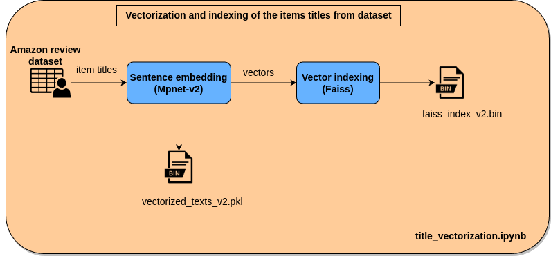
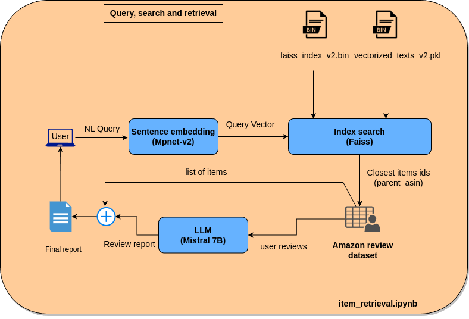

# Recommendation System based on Natural Language Queries

This project implements a recommendation system that utilizes natural language queries to recommend products from the [Amazon review dataset](https://cseweb.ucsd.edu/~jmcauley/datasets.html#amazon_reviews). Additionally, the system can generate a report highlighting the pros and cons of the recommended items.
For this POC I only used only beaty products which is a subset of this dataset.

## Table of Contents

- [Installation](#installation)
- [Usage](#usage)
- [Notebooks](#notebooks)
- [Contributing](#contributing)
- [License](#license)

## Installation

To install the project and its dependencies, follow these steps:

1. Create a virtual environment:
    ```bash
    python3 -m venv myenv
    ```

2. Activate the virtual environment:
    - For Windows:
      ```bash
      myenv\Scripts\activate
      ```
    - For macOS/Linux:
      ```bash
      source myenv/bin/activate
      ```

3. Clone the project repository:
    ```bash
    git clone https://github.com/Alishahed/amazon23_recom.git
    ```

4. Navigate to the project directory:
    ```bash
    cd your-project
    ```

5. Install the project dependencies using pip and the requirements.txt file:
    ```bash
    pip install -r requirements.txt
    ```

Now you have successfully installed the project and its dependencies in your virtual environment. You can proceed to use the project as described in the [Usage](#usage) section.

**Note**: I have implemented and tested this codebase in linux ubuntu. It should work for MacOS too ( I will update the README file if there are additional steps is needed for MacOS)

## Usage

### Notebooks

The project includes the following notebooks:

- [Sandbox/exploration](amazon_23_exploration.ipynb): This notebook is used for short experiments and exploring the dataset.
- [Title vectorization and indexing](title_vectorization.ipynb): This notebook is used to create vectors from item titles and index them. The resulting vectors and indices are saved in `vectorized_texts_v2.pkl` and `faiss_index_v2.bin`, respectively.
Here is the diagram of this part operation:


- [Item retrieval and recommendation](item_retrieval.ipynb): This is the main notebook that performs the following steps:
    1) Takes the user's query as input.
    2) Vectorizes the query.
    3) Searches and retrieves the closest item by finding the closest item vector from the vectorized items using Faiss indices.
    4) Aggregates user comments for each retrieved item and creates a report using an LLM.
    
**Note**: In order to experiment with the above notebooks, you need to download the datasets as well as vector and indeces file and save the in a folder called *data* in the same directory as the notebooks. You can find the location of these file in [Datasets, vectors and indeces](#datasets-vectors-and-indeces) section.

### Datasets, vectors and indeces

The *beaty product* dataset that I extracted from the much larger dataset provided by [Amazon review dataset](https://cseweb.ucsd.edu/~jmcauley/datasets.html#amazon_reviews) can be found in my [google drive](https://drive.google.com/drive/folders/165DPX6E1mP67-9epGzjHZIJQpv7p_mZf?usp=drive_link).
Also, you can find the vector and FAISS index files my [google drive](https://drive.google.com/drive/folders/1IExhhl-qCIkh5UE4c7NPOxSf73P7ifsP?usp=sharing)

## Contributing

Contributions to this project are welcome. Please contact Ali Shahed for more information.

## References

- [Modeling ambiguity, subjectivity, and diverging viewpoints in opinion question answering systems](https://www.aaai.org/ocs/index.php/ICDM/ICDM16/paper/view/11870) by Mengting Wan, Julian McAuley, International Conference on Data Mining (ICDM), 2016.
- [Addressing complex and subjective product-related queries with customer reviews](https://cseweb.ucsd.edu/~jmcauley/pdfs/www16a.pdf) by Julian McAuley, Alex Yang, World Wide Web (WWW), 2016.

## License

This project is licensed under the [MIT License](https://opensource.org/licenses/MIT). You are free to use, modify, and distribute the code without any restrictions.
